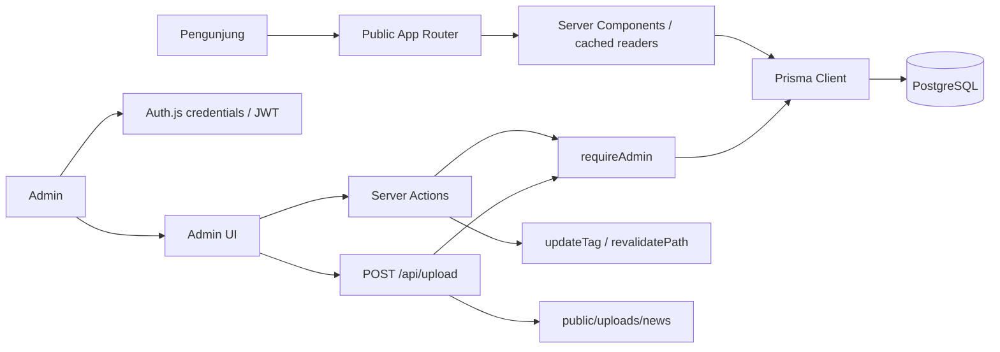

# System Architecture — PSI Surabaya

## 1. Architecture Overview

Aplikasi menggunakan Next.js App Router sebagai aplikasi full-stack: Server Components merender halaman dan membaca data di server, Client Components menangani interaksi browser, Server Actions menjalankan mutasi admin, dan Route Handlers melayani endpoint autentikasi serta upload. Prisma Client terhubung ke PostgreSQL melalui driver adapter `pg`.

Public dan admin dipisahkan dengan route group dan layout. Query tidak seluruhnya melalui service/repository layer: sejumlah reader berada di `src/lib/data.ts`, sementara halaman dan komponen tertentu mengakses Prisma secara langsung.

## 2. Technology Stack

| Teknologi | Peran |
|---|---|
| Next.js 16 App Router | Routing, rendering server/client, Server Actions, Route Handlers, dan Cache Components |
| React 19, TypeScript 5 | UI dan type checking |
| Tailwind CSS 4 | Styling berbasis utility dan token CSS |
| NextAuth v5 beta | Credentials authentication dan session JWT |
| Prisma 7 + `@prisma/adapter-pg` + `pg` | ORM dan koneksi PostgreSQL |
| PostgreSQL | Penyimpanan data aplikasi |
| `bcryptjs` | Verifikasi hash password |
| `sanitize-html` | Sanitasi konten berita dan agenda sebelum ditampilkan sebagai HTML |
| `framer-motion`, Lucide, React Icons, Font Awesome | Animasi dan ikon pada UI |

## 3. Project Structure

```text
.
├── prisma/
│   ├── migrations/
│   ├── schema.prisma
│   └── seed.ts
├── public/
│   ├── assets/                 # Aset statis website
│   ├── images/                # Pola visual
│   └── uploads/news/          # Target filesystem untuk upload
├── src/
│   ├── actions/                # Server Actions mutasi CMS
│   ├── app/
│   │   ├── (admin)/            # Login, reset UI, dashboard dan modul admin
│   │   ├── (public)/           # Halaman website publik
│   │   └── api/                # Auth.js dan upload
│   ├── components/
│   │   ├── admin/              # Form admin
│   │   ├── features/           # Komponen per fitur/domain
│   │   ├── layout/             # Navigasi dan kerangka public/admin
│   │   └── ui/                 # Primitif presentasi bersama
│   ├── config/                 # Konfigurasi situs
│   ├── generated/prisma/       # Prisma Client hasil generate
│   ├── lib/                    # Auth, Prisma, pembaca data, upload constraints
│   ├── server/                 # Entry point server/database
│   ├── types/                  # Tipe bersama
│   └── utils/                  # Utilitas kecil
├── proxy.ts                    # Konfigurasi proxy auth pada root
└── next.config.ts              # Cache Components dan remote image allowlist
```

Route publik aktual meliputi `/`, `/about`, `/news`, `/news/[slug]`, `/events`, `/events/[slug]`, `/members`, `/managements`, `/universities`, `/universities/[slug]`, `/research`, `/gallery`, dan `/contact`. Area admin berada di `/admin` dengan modul `news`, `events`, `members`, `managements`, `universities`, `publication`, dan `gallery`; halaman autentikasi berada di `/login`, `/forgot-password`, dan `/reset-password`.

## 4. Application Layers

- **UI / Presentation:** `src/components/ui` menyediakan komponen presentasi umum; `features` berisi UI per domain; `components/admin` berisi form pengelolaan. Server Components menjadi pola halaman utama, sedangkan komponen interaktif memakai Client Components.
- **Routing:** `src/app` menyusun route dan layout. `(public)` serta `(admin)` adalah route group yang tidak muncul pada URL. Root layout mengatur metadata, font, dan CSS global.
- **Authentication & Authorization:** Auth.js credentials memeriksa `User`; `requireAdmin()` membatasi operasi server ke `ADMIN` dan `SUPER_ADMIN`. Layout admin juga melakukan guard.
- **Server Actions / API:** `src/actions/*.ts` menangani mutasi CRUD dan memanggil Prisma. Route Handler `/api/auth/[...nextauth]` mengekspor handler Auth.js; `POST /api/upload` menerima upload gambar admin.
- **Data Access:** Reader publik berada terutama di `src/lib/data.ts` dan `src/components/features/research/data.ts`. Sebagian page/feature dan halaman admin melakukan query Prisma langsung. Tidak ada repository layer terpisah yang digunakan secara konsisten.
- **Database:** Prisma schema mendefinisikan model, enum, constraint, dan relasi PostgreSQL. Client dibuat bersama melalui `src/lib/prisma.ts`.

## 5. Data Flow



- **Public data:** halaman publik membaca record melalui cached readers atau query Prisma pada page/feature. Berita dan agenda publik difilter berdasarkan status `PUBLISHED`.
- **Admin CRUD:** form memanggil Server Actions; action memeriksa session/role, memvalidasi data sesuai modul, menulis ke PostgreSQL, lalu memicu invalidasi cache/route yang ditentukan.
- **Authentication:** credentials dikirim ke Auth.js handler, dicocokkan dengan akun aktif di database, dan password diverifikasi menggunakan bcrypt. JWT membawa `id` dan `role`.
- **File upload:** request multipart diperiksa session admin, tipe MIME/extension, signature file, dan ukuran; file ditulis ke filesystem lokal, kemudian URL root-relative dikembalikan.
- **Cache invalidation:** mutasi memanggil `updateTag()` dan/atau `revalidatePath()`. Route dan tag yang di-invalidasi berbeda antarmodul.

## 6. Database Design

| Model | Fungsi dan relasi utama |
|---|---|
| `User` | Akun admin, role, status aktif, dan relasi author berita/agenda. Tidak berelasi dengan `MemberProfile`. |
| `University` | Data perguruan tinggi; satu institusi dapat memiliki banyak `MemberProfile`. |
| `MemberProfile` | Direktori akademisi; relasi institusi opsional dan dapat menjadi anggota pada beberapa `ManagementPosition`. |
| `ManagementPeriod` | Periode kepengurusan dengan banyak posisi. |
| `ManagementPosition` | Jabatan/departemen/urutan dalam periode; anggota profil bersifat opsional. |
| `News` | Artikel dengan kategori, slug unik, status, waktu publikasi, dan author `User`. |
| `Event` | Agenda dengan kategori, slug unik, tanggal, status, dan author `User`. |
| `Publication` | Publikasi dengan tipe, deskripsi, tautan eksternal/berkas, dan tanggal publikasi. |
| `Gallery` | Item foto/video dengan URL media, kategori, unggulan, dan urutan. |

Enum utama mencakup `Role`, `ContentStatus`, `NewsCategory`, `EventCategory`, `PublicationType`, dan `MediaType`. Penghapusan periode menghapus posisi terkait; penghapusan institusi atau anggota mengosongkan referensi terkait sesuai `onDelete` pada schema. Tidak ada model `ContactMessage` pada schema aktual.

## 7. Authentication & Authorization

- Auth.js v5 menggunakan Credentials provider, akun `User` di Prisma, pemeriksaan `isActive`, dan verifikasi password hash dengan `bcryptjs`.
- Strategi session adalah JWT. Callback menyimpan `id` dan `role` ke token lalu menyalurkannya ke session.
- Role yang diizinkan pada admin adalah `ADMIN` dan `SUPER_ADMIN`; implementasi guard tidak membedakan hak kedua role.
- Admin dilindungi pada layout (`requireAdmin()`), dan Server Actions serta route upload melakukan pemeriksaan otorisasi server.
- Mock authentication hanya aktif bila `NODE_ENV === "development"` dan `NEXT_PUBLIC_MOCK_AUTH === "true"`.
- Terdapat konfigurasi `proxy.ts` di root dan `src/middleware.ts` dengan matcher berbeda. Pemilihan entrypoint efektif perlu dipastikan untuk konfigurasi Next.js/runtime yang digunakan; guard layout dan server tetap merupakan lapisan otorisasi aplikasi.

## 8. Caching & Data Synchronization

`next.config.ts` mengaktifkan `cacheComponents`. Reader data publik menggunakan directive `use cache`, `cacheLife("hours")`, dan tag domain seperti `news`, `events`, `members`, `managements`, `gallery`, `universities`, serta `publications`. Mutasi menggunakan `updateTag()` dan/atau `revalidatePath()` untuk menyegarkan reader dan route terkait.

Tidak semua query melalui reader cache; beranda dan beberapa feature/page melakukan query Prisma langsung. Detail tag, path, dan cakupan invalidasi berbeda berdasarkan action. Periksa pasangan query/action pada modul yang sedang dipelihara sebelum mengubah strategi cache.

## 9. Environment & Configuration

| Variabel | Kegunaan |
|---|---|
| `DATABASE_URL` | URL koneksi PostgreSQL untuk Prisma dan seed. |
| `AUTH_SECRET` | Secret konfigurasi Auth.js. |
| `NEXT_PUBLIC_SITE_URL` | Base URL metadata, `robots.txt`, dan sitemap; source menyediakan fallback. |
| `NEXT_PUBLIC_MOCK_AUTH` | Mengaktifkan mock auth hanya bersama `NODE_ENV=development`. |
| `ADMIN_EMAIL` | Email akun admin yang dibuat/diperbarui oleh seed. |
| `ADMIN_PASSWORD` | Password input seed yang di-hash sebelum disimpan. |
| `NODE_ENV` | Menentukan mode runtime dan membatasi mock auth ke development. |

`prisma.config.ts` menetapkan schema, direktori migrasi, seed, dan datasource dari environment. `docker-compose.yml` menyediakan PostgreSQL untuk penggunaan lokal; file tersebut bukan konfigurasi deployment aplikasi.

## 10. Technical Constraints & Known Issues

- Upload disimpan di filesystem aplikasi, sehingga persistensi file bergantung pada filesystem/runtime tempat aplikasi berjalan; tidak ada integrasi object storage pada source yang ditelusuri.
- Galeri carousel beranda memakai data lokal, berbeda dari galeri CMS/database.
- Halaman reset password dan tampilan pesan dashboard tidak didukung workflow/model backend yang setara.
- Akses Prisma tersebar antara cached reader, page/feature, dan Server Actions; perubahan query perlu memeriksa jalur konsumsi dan invalidasi terkait.
- Repository memuat konfigurasi proxy dan middleware sekaligus; perilaku runtime-nya perlu dikonfirmasi sebelum perubahan pada proteksi route.
- Temuan audit dan backlog maintenance dirujuk pada `TODO.md`; dokumen ini tidak menyatakan audit keamanan, deployment, atau pengujian production telah selesai.
